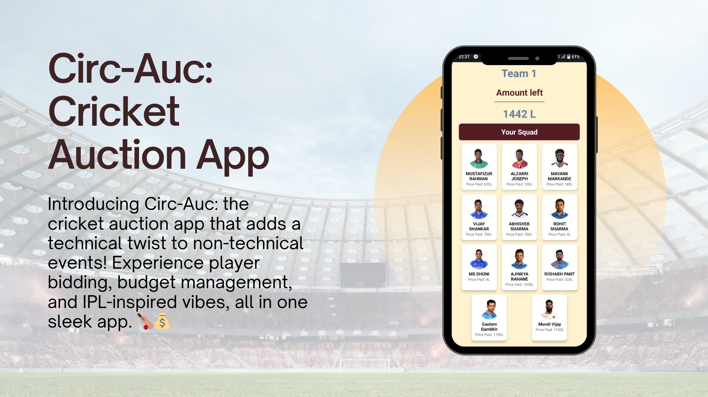

# Circ-Auc - Cricket Auction App

Circ-Auc is a cricket auction app developed by [Your Team Name] for InfusionX, our college event. It adds a technical touch to the non-technical event by providing a digital platform for conducting cricket auctions.

## Features

- **Player Display**: Players are displayed in card format showcasing their image, name, and the price they were sold for during the auction.
- **Purse Management**: The app dynamically updates the total purse of each team by deducting the price of players bought during the auction.
- **Interactive UI**: The app features an intuitive and user-friendly interface designed using React Native and Expo.
- **IPL Theme Music**: Adds a touch of excitement with background music reminiscent of the Indian Premier League (IPL).
- **Responsive Design**: The app is built using React Native, ensuring compatibility across various devices and screen sizes.

## Team Members
- Yogesh Bhandare
- Rajat Pawar
- Aditya Damse

## Technologies Used
- React Native
- Expo
- JavaScript
- HTML/CSS

## Project Duration
4 days

## How to Run
1. Clone the repository: `git clone https://github.com/yourusername/circ-auc.git`
2. Ensure you have node.js installed
3. Navigate to the project directory: `cd circ-auc`
4. Install dependencies: `npm install`
5. Start the Expo server: `npm start`
6. Scan the QR code using the Expo Go app on your mobile device or run on an emulator.
